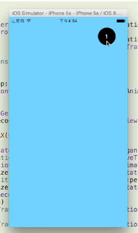

# PingTransitionDemo

[教程热线](http://www.kittenyang.com/pingtransition/)	
	
做过几次动画之后，感觉千篇一律，开头总是类似，最终实现方案是在`- (void)animateTransition:(id<UIViewControllerContextTransitioning>)transitionContext`方法的实现上有所不同而已

##开工
OK,直接进入重点
`
- (void)animateTransition:(id<UIViewControllerContextTransitioning>)transitionContext`，
在push阶段，因为是做的圈形动画效果，所以应该先去计算出最初的圆形按钮所在圈的位置	

```	
UIButton *button = fromVC.button;

UIBezierPath *maskStartPath = [UIBezierPath bezierPathWithOvalInRect:button.frame];

```
很简单的方法，得到初始值的圆位置。

最终圆形的圆心和初始圆心事一样的。所以最后的问题就是如何得到半径。
最大半径即是圆心离屏幕点里的距离最大值，在该例子中，很明显，是左下角。
so，基础的勾股定理出来了。

```
x = button.center.x;
y = |button.center.y - CGRectGetHeight(fromVC.view.frame)|;

radius = sqrt(x*x + y*y);
```

接下来就是计算最终的圆形轨迹了，可以使用CGRectInset计算出矩形

```
CGRect finalRect = CGRectInset(button.frame, -radius, -radius);

UIBezierPath *maskFinalPath = [UIBezierPath bezierPathWithOvalInRect:finalRect];
```
接下来创建动画,需要使用到layer

```
CAShapeLayer *maskLayer = [CAShapeLayer layer];
maskLayer.path = maskFinalPath.CGPath;
toVC.view.layer.mask = maskLayer;

CABaseAnimation *maskLayerAnimation = [CABaseAnimation animationWithKeyPath:@"path"];
maskLayerAnimation.fromValue = (__bridge id)(maskStartPath.CGPath);
maskLayerAnimation.toValue = (__bridge id)(maskFinalPath.CGPath);
maskLayerAnimation.duration = [self transitionDuratoin:transitionContext];
maskLayerAnimation.delegate = self;

[maskLayer addAnimation:maskLayerAnimation forKey:@"path"];

```

需要注意的是，这里会用到AnimationDelegate，所以需要将transitionContext变量存下来。

```
- (void)animationDidStop:(CAAnimation *)anim finished:(BOOL)flag {
	[self.transitionContext completeTransition:YES];
	[self.transitionContext viewControllerForKey:UITransitionContextToViewControllerKey].view.layer.mask = nil;
}
```

##总结
转场动画的基础就到这里了，想要做更复杂的转场动画，需要自己去学习如何精准熟练地使用Core animation之类的库。